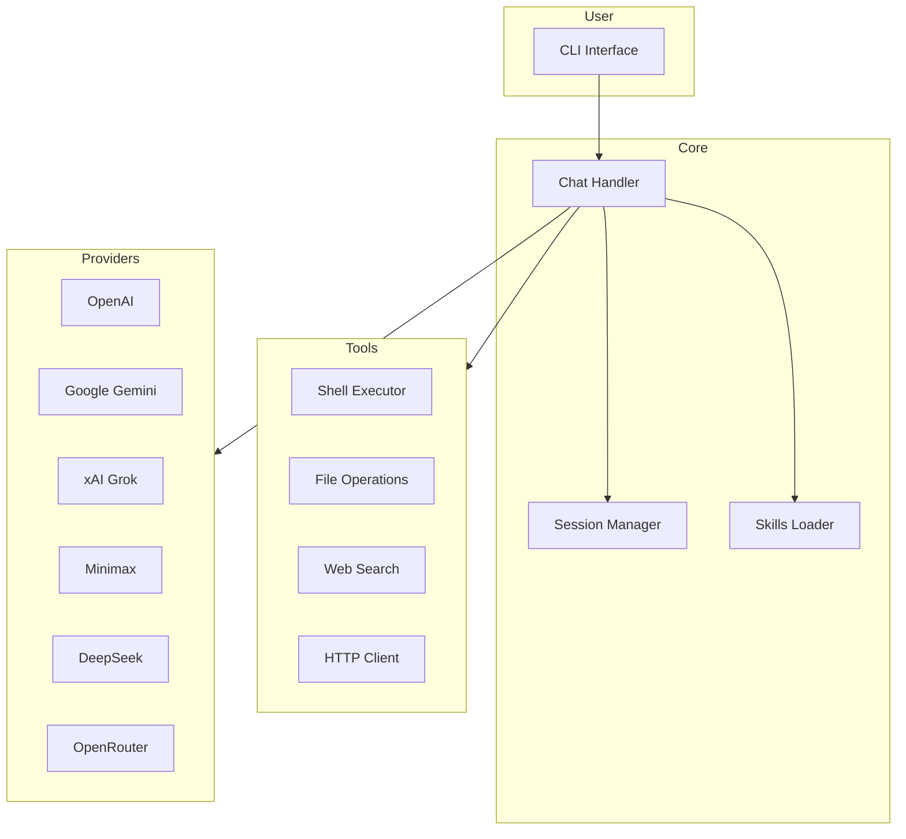

# Open-CLI

<p align="center">
  <a href="https://www.npmjs.com/package/opencli">
    
  </a>
  <a href="https://github.com/anomalyco/openCLI/actions">
    
  </a>
  <a href="https://github.com/anomalyco/openCLI/blob/main/LICENSE">
    
  </a>
  <a href="https://github.com/anomalyco/openCLI/stargazers">
    
  </a>
</p>

A powerful multi-provider AI terminal assistant with built-in tools, session management, and extensibility. Interact with GPT-4, Gemini, Grok, DeepSeek, and other models directly from your command line.

## Overview

Open-CLI brings large language models to your terminal. Whether you need quick code reviews, file manipulation, web searches, or complex multi-step tasks, Open-CLI provides an interactive chat interface with access to a rich set of built-in tools.



## Key Features

| Feature                | Description                                                                       |
| ---------------------- | --------------------------------------------------------------------------------- |
| **Multi-Provider**     | 15+ curated models across OpenAI, Gemini, Grok, Minimax, DeepSeek, and OpenRouter |
| **Built-in Tools**     | Shell execution, file operations, web search, HTTP requests                       |
| **Session Management** | Save, resume, and share conversations                                             |
| **MCP Support**        | Connect to Model Context Protocol servers                                         |
| **Custom Commands**    | Define slash commands in TOML                                                     |
| **Skills**             | Reusable AI instruction sets in markdown                                          |
| **AGENTS.md**          | Hierarchical context files for project-specific instructions                      |
| **Headless Mode**      | CI/CD integration with `-p` flag                                                  |
| **Token Tracking**     | Accurate counting and cost estimation                                             |

## Installation

```bash
npm install -g opencli
```

Or run without installing:

```bash
npx opencli
```

**Requirements:** Node.js 20+

## Quick Start

```bash
# Set at least one API key
export OPENAI_API_KEY=sk-...
export GOOGLE_API_KEY=AI...
export XAI_API_KEY=x...
export MINIMAX_API_KEY=...
export DEEPSEEK_API_KEY=sk-...
export OPENROUTER_API_KEY=sk-or-...

# Start interactive chat
opencli

# Or run a single prompt
opencli -p "Explain what this codebase does"
```

## Supported Providers

| Provider      | Models                           | Environment Variable |
| ------------- | -------------------------------- | -------------------- |
| OpenAI        | gpt-4o, gpt-4o-mini, o1, o1-mini | `OPENAI_API_KEY`     |
| Google Gemini | gemini-2.0-flash, gemini-1.5-pro | `GOOGLE_API_KEY`     |
| xAI Grok      | grok-2, grok-2-vision            | `XAI_API_KEY`        |
| Minimax       | MoE-8x7B, text-01                | `MINIMAX_API_KEY`    |
| DeepSeek      | deepseek-chat, deepseek-coder    | `DEEPSEEK_API_KEY`   |
| OpenRouter    | claude-3.5, llama-3.3, and more  | `OPENROUTER_API_KEY` |

## Usage

### Interactive Mode

```bash
opencli
```

**Chat Commands:**

- `/help` - Show help message
- `/models` - Switch model
- `/provider` - Switch provider
- `/skills` - List loaded skills
- `/skill:<name>` - Invoke a skill
- `/stats` - Show session statistics
- `/copy` - Copy last response
- `/clear` - Clear conversation
- `/exit` - Exit the application

### Session Management

```bash
/chat save <tag>      # Save current conversation
/chat list           # List saved sessions
/chat resume <tag>   # Resume a saved session
/chat delete <tag>   # Delete a saved session
/chat share [tag]    # Export session to markdown
```

### File Context

```bash
@file.ts           # Include single file
@src/              # Include all files in directory
@src/**/*.ts       # Include files matching glob pattern
```

### Shell Passthrough

```bash
!ls -la           # Execute shell command
!                 # Toggle shell mode
```

### Headless Mode

```bash
# Single prompt, exit after response
opencli -p "Explain this codebase"

# JSON output for parsing
opencli -p "List all TODOs" --output-format json

# Stream JSON events
opencli -p "Run tests" --output-format stream-json
```

## Advanced Features

### MCP Servers

Configure in `~/.open-cli/settings.json`:

```json
{
  "mcpServers": {
    "github": {
      "command": "mcp-server-github",
      "env": { "GITHUB_TOKEN": "$GITHUB_TOKEN" }
    }
  }
}
```

Commands: `/mcp`, `/mcp refresh`

### Custom Commands

Create in `~/.open-cli/commands/` as TOML files:

```toml
# ~/.open-cli/commands/review.toml
name = "review"
description = "Review code for issues"
prompt = """
Review this code for bugs, security issues, and improvements:

@{{args}}

Focus on:
- Logic errors
- Security vulnerabilities
- Performance issues
"""
```

Usage: `/review src/index.ts`

### Skills

Define reusable AI instruction sets:

```markdown
# ~/.open-cli/skills/code-review.md

---

name: code-review
description: Reviews code for bugs, security issues, and style

---

You are an expert code reviewer. When reviewing code:

- Check for security vulnerabilities
- Look for performance issues
- Suggest idiomatic improvements
```

Locations:

- `~/.open-cli/skills/` — global skills
- `.opencli/skills/` — project-local skills

Commands: `/skills`, `/skills reload`, `/skill:code-review`

### AGENTS.md Context

Hierarchical context files:

- `~/.open-cli/AGENTS.md` - Global context
- `<project>/AGENTS.md` - Project context
- `<subdir>/AGENTS.md` - Directory-specific context

Commands: `/memory show`, `/memory add`, `/memory refresh`, `/memory list`

## Configuration

Settings stored in `~/.open-cli/settings.json`:

```json
{
  "defaultProvider": "openai",
  "defaultModel": "gpt-4o",
  "preferences": {
    "temperature": 0.7
  },
  "styles": {
    "promptColor": "cyan",
    "codeTheme": "monokai"
  },
  "mcpServers": {}
}
```

## Command-Line Options

| Flag                  | Description                               |
| --------------------- | ----------------------------------------- |
| `-p, --prompt <text>` | Run in headless mode with a single prompt |
| `--provider <name>`   | Provider to use                           |
| `-m, --model <id>`    | Model to use                              |
| `-o, --output-format` | Output format (text, json, stream-json)   |
| `--verbose`           | Enable info-level logging                 |
| `--debug`             | Enable debug-level logging                |

## Development

```bash
# Install dependencies
npm install

# Run in development mode
npm run dev

# Build
npm run build

# Run tests
npm test

# Lint
npm run lint
```

## License

MIT License
